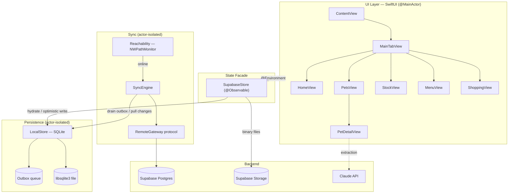
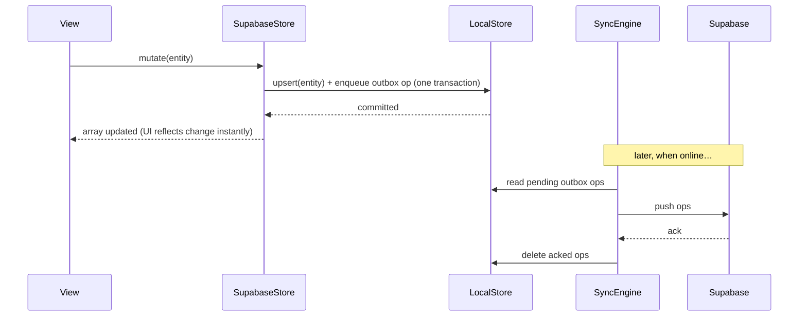

# Home

> A personal, **offline-first** iOS app for running a household — pets, clinical records, tasks, and stock — backed by Supabase with a local-first sync engine.

Home keeps every entity on-device in SQLite so the app is fully usable with no
network. A background sync engine reconciles local changes with Supabase the
moment connectivity returns. Built with **SwiftUI** and **Swift 6 strict
concurrency** end to end.


---

## Highlights

- **Offline-first by default.** All reads and writes hit a local SQLite store; the UI never waits on the network.
- **Conflict-aware sync.** An outbox + cursor-based pull engine reconciles with Supabase using last-write-wins on `updated_at`, with soft-delete tombstones.
- **Swift 6 strict concurrency.** `@MainActor`-isolated by default; SQLite and sync work confined to dedicated `actor`s. No `@unchecked Sendable`, no data races.
- **Zero third-party dependencies** beyond the Supabase Swift SDK — persistence is built on the system `libsqlite3`.
- **AI document extraction.** Vet PDFs and photos are parsed into structured clinical data via the Claude API.

---

## Features

### 🏠 Home Timeline
Unified feed merging upcoming vet appointments and recurring household tasks, sorted by due date. One-tap actions: mark done, snooze, delete, add to calendar.

### 🐾 Pets
Per-pet detail pages with photo management (upload / crop / cache-bust), birthday and age display, and five data sections:

| Section | What it stores |
|---------|---------------|
| Vet | Primary veterinarian contact and clinic info |
| Appointments | Scheduled visits with status tracking (upcoming / done / cancelled) |
| Clinical History | Diagnoses, treatment notes, uploaded documents |
| Events | Milestones, grooming, training — any custom event |
| Files | Photos and PDFs with AI-powered document extraction |

### 🤖 AI Document Extraction
Upload a vet document (PDF or photo) and Claude parses it into structured `ClinicalEntry` data — diagnosis, notes, dates — ready to save with one tap.

### 📋 Household Tasks
Recurring tasks with configurable intervals, custom sections (SF Symbol icons), and snooze/calendar integration.

### 📦 Stock & Meals
Track household stock products and pet meal plans — all local-first and synced.

---

## Architecture

`SupabaseStore` (`@Observable`) is the single in-memory facade the UI binds to.
It is **hydrated from `LocalStore`** (SQLite) rather than from the network, and
every mutation is **optimistic and transactional** — the entity row and its
outbox operation are written in one local transaction, then the UI updates
immediately. A `SyncEngine` actor later reconciles with Supabase.



See [`docs/architecture.md`](docs/architecture.md) for the full module dependency graph ·
Data model: [`docs/data-model.md`](docs/data-model.md) ·
User flows: [`docs/user-flows.md`](docs/user-flows.md)

---

## Offline-First & Sync Model

The durable source of truth is **on-device SQLite**, not Supabase. The network
is treated as an eventually-consistent replica.

### Components

| Component | Responsibility | Isolation |
|-----------|---------------|-----------|
| `LocalStore` | Generic entity CRUD, outbox, and per-table sync cursor over `libsqlite3` | `actor` |
| `SQLiteDatabase` | Low-level connection, prepared statements, transactions | `actor` |
| `Outbox` | Pending `insert` / `update` / `delete` operations awaiting push | pure types |
| `SyncEngine` | Push outbox → pull changes → reconcile | `actor` |
| `Reachability` | `NWPathMonitor` → `AsyncStream<Bool>`, drives reconnect sync | `@MainActor` facade |
| `RemoteGateway` | Protocol isolating Supabase so sync is unit-testable offline | protocol |

All ten non-file entities are synced: `pets`, `veterinarians`, `appointments`,
`clinical_entries`, `pet_events`, `task_sections`, `household_tasks`,
`stock_products`, `meals`, `meal_products`. Binary files continue to go directly
to Supabase Storage.

### Write path (optimistic)



### Reconciliation rules

- **Last-write-wins** by `updated_at` — incoming rows overwrite local only if newer.
- **Soft deletes** — deletions are `deleted_at` tombstones, propagated like any other change so deletes survive across devices.
- **Cursor-based pulls** — each table tracks its last-synced timestamp; pulls fetch only rows changed since the cursor.
- **Reconnect-triggered** — `Reachability` emits `online`, which kicks `SyncEngine.sync` then re-hydrates `SupabaseStore`.

This keeps the launch path network-free: `ContentView` hydrates from SQLite and
renders immediately, then sync runs in the background.

---

## Getting Started

**Prerequisites:** Xcode 16+, a Supabase project.

1. Clone the repo and open `Home.xcodeproj`.

2. Create `Config.xcconfig` at the repo root (git-ignored):

   ```
   SUPABASE_URL = https://your-project.supabase.co
   SUPABASE_ANON_KEY = eyJ...
   ```

   These are injected into `Info.plist` at build time. The app `fatalError`s at launch if either key is missing.

3. Apply the database schema (includes the `updated_at` / `deleted_at` sync columns):

   ```bash
   supabase db push
   ```

4. Build and run (`Cmd+R`).

---

## Building & Testing

Build and test through Xcode — there is no CLI build script.

| Action | Shortcut |
|--------|----------|
| Build  | `Cmd+B` (must be zero-error before committing) |
| Test   | `Cmd+U` (all tests must pass) |
| Run    | `Cmd+R` |

Sync logic is unit-tested without a network via the `RemoteGateway` protocol —
see `HomeTests/Sync/` and `HomeTests/Persistence/`.

---

## Tech Stack

| Layer | Technology |
|-------|-----------|
| UI | SwiftUI + Swift 6 strict concurrency (`@MainActor` default) |
| State | `@Observable` (`SupabaseStore`) |
| Local persistence | SQLite via system `libsqlite3` (`LocalStore`, `SQLiteDatabase` actors) |
| Sync | Outbox + cursor pull (`SyncEngine`), last-write-wins reconciliation |
| Reachability | `Network.NWPathMonitor` |
| Backend | Supabase (PostgreSQL + Storage) |
| AI | Claude API (document extraction) |
| Auth | Supabase Auth |
| Calendar | EventKit (`CalendarService`) |
