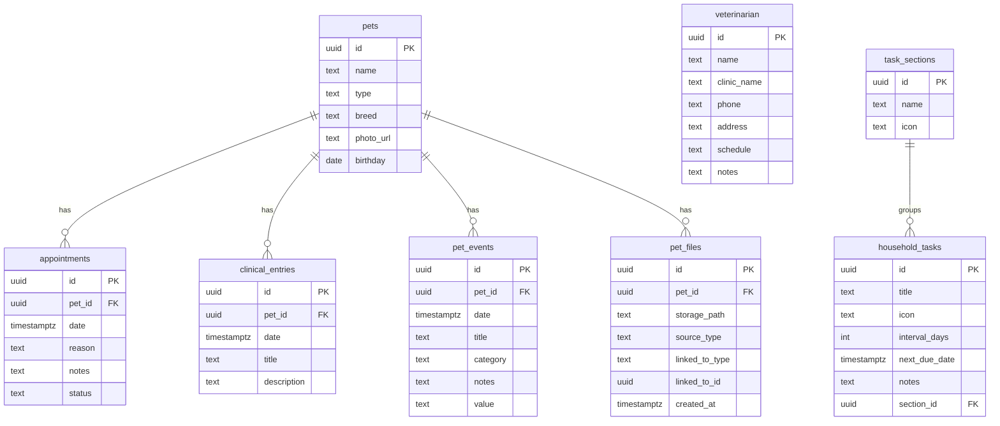

# Data Model

Entity relationships for all Supabase tables.


```mermaid
erDiagram
    pets {
        uuid id PK
        text name
        text type
        text breed
        text photo_url
        date birthday
    }
    veterinarian {
        uuid id PK
        text name
        text clinic_name
        text phone
        text address
        text schedule
        text notes
    }
    appointments {
        uuid id PK
        uuid pet_id FK
        timestamptz date
        text reason
        text notes
        text status
    }
    clinical_entries {
        uuid id PK
        uuid pet_id FK
        timestamptz date
        text title
        text description
    }
    pet_events {
        uuid id PK
        uuid pet_id FK
        timestamptz date
        text title
        text category
        text notes
        text value
    }
    pet_files {
        uuid id PK
        uuid pet_id FK
        text storage_path
        text source_type
        text linked_to_type
        uuid linked_to_id
        timestamptz created_at
    }
    household_tasks {
        uuid id PK
        text title
        text icon
        int interval_days
        timestamptz next_due_date
        text notes
        uuid section_id FK
    }
    task_sections {
        uuid id PK
        text name
        text icon
    }

    pets ||--o{ appointments : "has"
    pets ||--o{ clinical_entries : "has"
    pets ||--o{ pet_events : "has"
    pets ||--o{ pet_files : "has"
    task_sections ||--o{ household_tasks : "groups"
```
```
