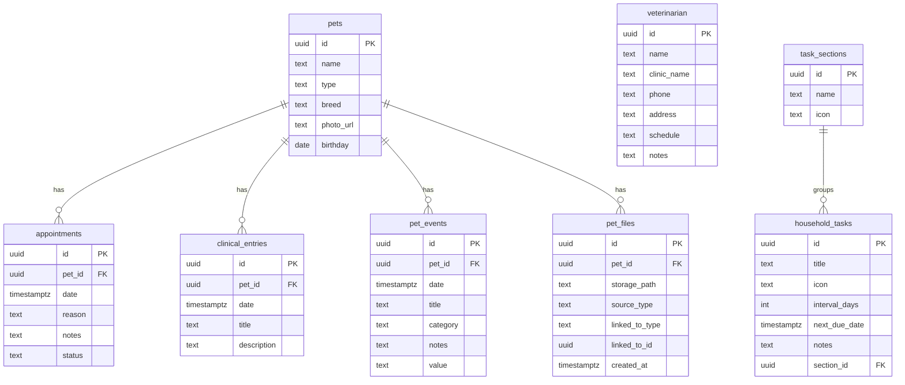
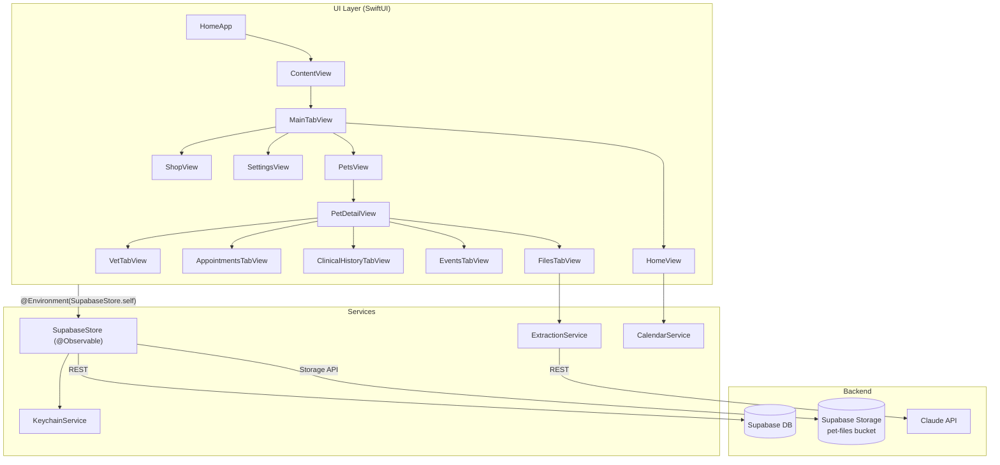
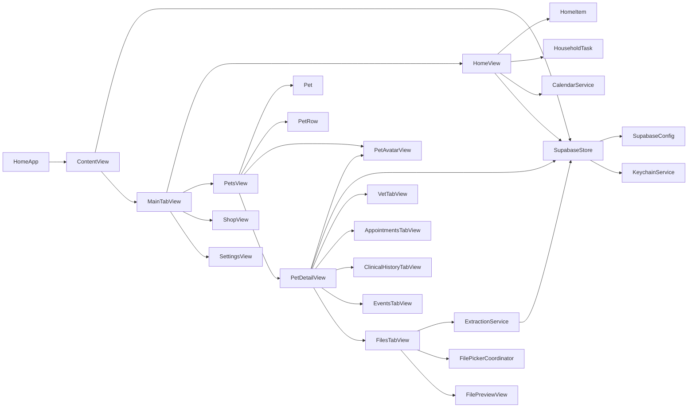
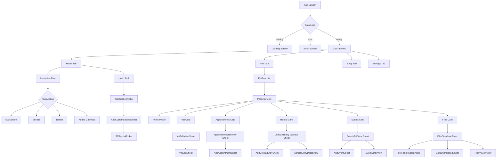
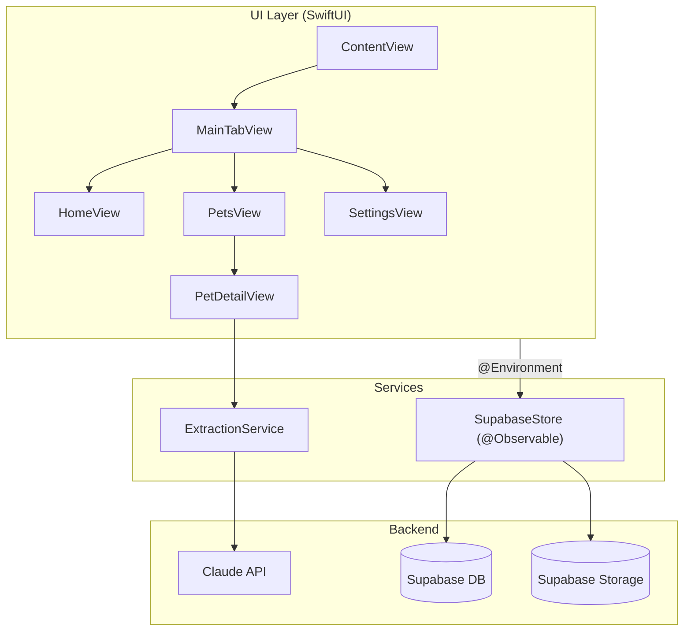

# Project Documentation Implementation Plan

> **For agentic workers:** REQUIRED SUB-SKILL: Use superpowers:subagent-driven-development (recommended) or superpowers:executing-plans to implement this plan task-by-task. Steps use checkbox (`- [ ]`) syntax for tracking.

**Goal:** Add a portfolio-grade README and `/docs` Mermaid diagrams (architecture, data model, user flows, module dependency) to the project, and remove all superpowers plugin traces from the repo.

**Architecture:** Worktree off `main` → remove plugin artifacts → write four Markdown files with Mermaid diagrams → write root `README.md`. No Swift code changes.

**Tech Stack:** Git worktrees, Markdown, Mermaid (GitHub-native), SwiftUI / Supabase context for diagram content.

---

## File Map

| Action | Path |
|--------|------|
| Remove | `.superpowers/` |
| Remove | `docs/superpowers/` |
| Create | `README.md` |
| Create | `docs/architecture.md` |
| Create | `docs/data-model.md` |
| Create | `docs/user-flows.md` |

---

### Task 1: Create git worktree from main

**Files:** none (git operation)

- [ ] **Step 1: Verify main is up to date**

```bash
git fetch origin main
git log --oneline origin/main -5
```

Expected: shows recent commits, no divergence warnings.

- [ ] **Step 2: Create worktree**

```bash
git worktree add ../Home-docs -b docs/project-documentation origin/main
```

Expected output includes: `Preparing worktree (new branch 'docs/project-documentation')`.

- [ ] **Step 3: Verify worktree**

```bash
git worktree list
```

Expected: two entries — current repo and `../Home-docs` on branch `docs/project-documentation`.

- [ ] **Step 4: Switch into worktree for all remaining tasks**

```bash
cd ../Home-docs
ls
```

Expected: same root structure as main (`Home/`, `Home.xcodeproj/`, `supabase/`, etc.).

---

### Task 2: Remove superpowers plugin traces

**Files:**
- Remove: `.superpowers/`
- Remove: `docs/superpowers/`

- [ ] **Step 1: Remove directories from tracking and disk**

```bash
git rm -r --cached .superpowers docs/superpowers
rm -rf .superpowers docs/superpowers
```

Expected: lists removed files, no errors.

- [ ] **Step 2: Verify removal**

```bash
ls -la | grep superpowers
ls docs/
```

Expected: no `superpowers` entries. `docs/` shows only `plans/` (if it exists).

- [ ] **Step 3: Add .gitignore entry to prevent re-tracking**

Append to `.gitignore`:

```
.superpowers/
docs/superpowers/
```

- [ ] **Step 4: Commit**

```bash
git add .gitignore
git commit -m "chore: remove superpowers plugin traces from repo"
```

---

### Task 3: Create docs/data-model.md

**Files:**
- Create: `docs/data-model.md`

- [ ] **Step 1: Create file**

```markdown
# Data Model

Entity relationships for all Supabase tables.


```

- [ ] **Step 2: Commit**

```bash
git add docs/data-model.md
git commit -m "docs: add data model ER diagram"
```

---

### Task 4: Create docs/architecture.md

**Files:**
- Create: `docs/architecture.md`

- [ ] **Step 1: Create file**

```markdown
# Architecture

## App Layer Diagram



`SupabaseStore` is created once in `ContentView` and passed down via `.environment(store)`. Every view reads and mutates app state through it — no local caches, no view models.

---

## Module Dependency Graph


```

- [ ] **Step 2: Commit**

```bash
git add docs/architecture.md
git commit -m "docs: add architecture and module dependency diagrams"
```

---

### Task 5: Create docs/user-flows.md

**Files:**
- Create: `docs/user-flows.md`

- [ ] **Step 1: Create file**

```markdown
# User Flows

Screen navigation and interaction paths.


```

- [ ] **Step 2: Commit**

```bash
git add docs/user-flows.md
git commit -m "docs: add user flow navigation diagram"
```

---

### Task 6: Create README.md

**Files:**
- Create: `README.md`

- [ ] **Step 1: Create file**

````markdown
# Home

A personal iOS app for managing your household — pets, tasks, and everything in between.

Built with **SwiftUI**, **Swift 6 strict concurrency**, and **Supabase** as the backend.


---

## Features

### 🏠 Home Timeline
Unified feed of upcoming vet appointments and recurring household tasks, sorted by due date. One-tap actions: mark done, snooze, delete, add to calendar.

### 🐾 Pets
Per-pet detail pages with photo management (upload / crop / cache-bust), birthday and age display, and five data sections:

| Section | What it stores |
|---------|---------------|
| Vet | Primary veterinarian contact and clinic info |
| Appointments | Scheduled visits with status tracking (upcoming / done / cancelled) |
| Clinical History | Diagnoses, treatment notes, uploaded documents |
| Events | Milestones, grooming, training — any custom event |
| Files | Photos and PDFs with AI-powered document extraction |

### 🤖 AI Document Extraction
Upload a vet document (PDF or photo) and Claude parses it into structured `ClinicalEntry` data — diagnosis, notes, dates — ready to save with one tap.

### 📋 Household Tasks
Recurring tasks with configurable intervals, custom sections (with SF Symbol icons), and snooze/calendar integration.

---

## Architecture



`SupabaseStore` is the single source of truth — created once in `ContentView`, injected app-wide via `.environment`. No caching layer, no view models. See [`docs/architecture.md`](docs/architecture.md) for the full module dependency graph.

Data model: [`docs/data-model.md`](docs/data-model.md) · User flows: [`docs/user-flows.md`](docs/user-flows.md)

---

## Getting Started

**Prerequisites:** Xcode 16+, a Supabase project.

1. Clone the repo and open `Home.xcodeproj`.

2. Create `Config.xcconfig` at the repo root:

```
SUPABASE_URL = https://your-project.supabase.co
SUPABASE_ANON_KEY = eyJ...
```

3. Apply the database schema:

```bash
supabase db push
```

4. Build and run (`Cmd+R`).

---

## Tech Stack

| Layer | Technology |
|-------|-----------|
| UI | SwiftUI + Swift 6 strict concurrency |
| State | `@Observable` (`SupabaseStore`) |
| Backend | Supabase (PostgreSQL + Storage) |
| AI | Claude API (document extraction) |
| Auth | Supabase Auth |
| Calendar | EventKit (`CalendarService`) |
````

- [ ] **Step 2: Verify Mermaid renders on GitHub** (visual check — open the file in a GitHub preview or [mermaid.live](https://mermaid.live) and paste the diagram block)

- [ ] **Step 3: Commit**

```bash
git add README.md
git commit -m "docs: add portfolio README with feature overview and architecture diagram"
```

---

### Task 7: Push branch

- [ ] **Step 1: Push worktree branch**

```bash
git push -u origin docs/project-documentation
```

- [ ] **Step 2: Verify on GitHub** — confirm `README.md` renders correctly on the branch landing page, Mermaid diagrams display in `docs/*.md`.

- [ ] **Step 3: Open PR to main when satisfied**

```bash
gh pr create \
  --title "docs: add README, architecture, data model, and user flow diagrams" \
  --body "Adds portfolio README and /docs Mermaid diagrams. Removes superpowers plugin traces." \
  --base main
```
