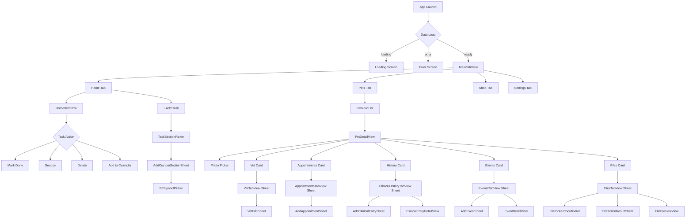

# User Flows

Screen navigation and interaction paths.

```mermaid
flowchart TD
    Launch[App Launch] --> Gate{Data Load}
    Gate -->|loading| Loading[Loading Screen]
    Gate -->|error| Error[Error Screen]
    Gate -->|ready| Tabs[MainTabView]

    Tabs --> Home[Home Tab]
    Tabs --> Pets[Pets Tab]
    Tabs --> Shop[Shop Tab]
    Tabs --> Settings[Settings Tab]

    Home --> Row[HomeItemRow]
    Row --> TaskMenu{Task Action}
    TaskMenu --> Done[Mark Done]
    TaskMenu --> Snooze[Snooze]
    TaskMenu --> Del[Delete]
    TaskMenu --> Cal[Add to Calendar]
    Home --> AddTask[+ Add Task]
    AddTask --> SectionPicker[TaskSectionPicker]
    SectionPicker --> AddSection[AddCustomSectionSheet]
    AddSection --> SymPicker[SFSymbolPicker]

    Pets --> PetList[PetRow List]
    PetList --> PetDetail[PetDetailView]
    PetDetail --> PhotoPicker[Photo Picker]
    PetDetail --> VetCard[Vet Card]
    PetDetail --> ApptCard[Appointments Card]
    PetDetail --> HistCard[History Card]
    PetDetail --> EventCard[Events Card]
    PetDetail --> FilesCard[Files Card]

    VetCard --> VetTab[VetTabView Sheet]
    VetTab --> VetEdit[VetEditSheet]

    ApptCard --> ApptTab[AppointmentsTabView Sheet]
    ApptTab --> AddAppt[AddAppointmentSheet]

    HistCard --> HistTab[ClinicalHistoryTabView Sheet]
    HistTab --> AddEntry[AddClinicalEntrySheet]
    HistTab --> EntryDetail[ClinicalEntryDetailView]

    EventCard --> EventTab[EventsTabView Sheet]
    EventTab --> AddEvent[AddEventSheet]
    EventTab --> EventDetail[EventDetailView]

    FilesCard --> FilesTab[FilesTabView Sheet]
    FilesTab --> FilePicker[FilePickerCoordinator]
    FilesTab --> Extraction[ExtractionResultSheet]
    FilesTab --> Preview[FilePreviewView]
```
